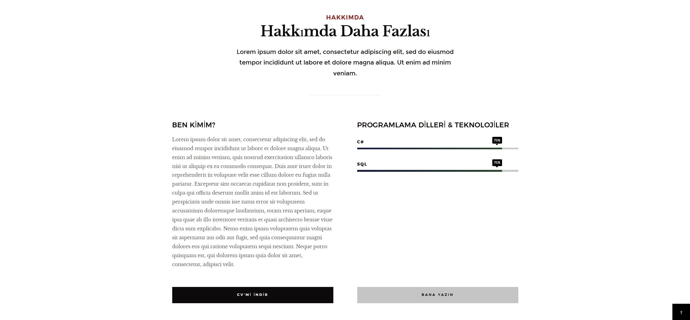
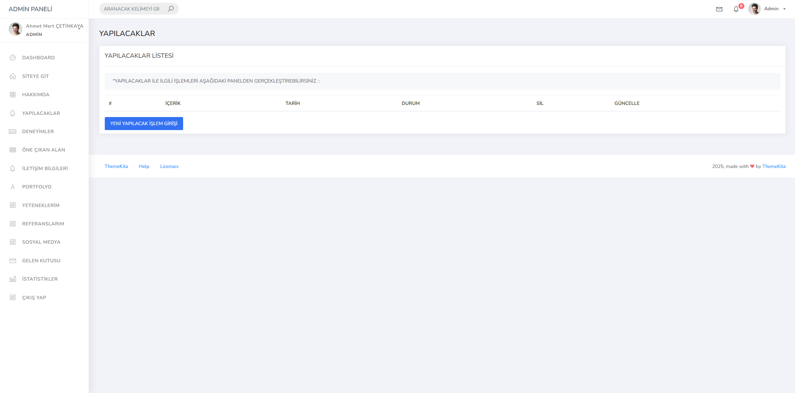

# 🚀 Dinamik ASP.NET Core Portfolyo Projesi

ASP.NET Core ile geliştirilmiş, **ViewComponent** yapıları kullanan ve admin paneli bulunan dinamik portfolyo uygulaması.  
Projede yapılacak işler takibi, içerik yönetimi gibi özellikler modern ve kullanıcı dostu arayüz ile sunulmaktadır.

---

## 📌 Özellikler

- ASP.NET Core MVC mimarisi  
- Dinamik **To-Do List** yönetimi (yapılacaklar listesi)  
- **ViewComponent** kullanımı ile modüler yapı  
- Yönetici paneli üzerinden kolay içerik yönetimi  
- Bootstrap ile responsive ve şık tasarım  
- CRUD işlemleri (Ekle, Sil, Güncelle)  
- Proje yapısı kolay genişletilebilir

---

## 🖼️ Ekran Görüntüleri

| Ana Sayfa | Hakkımda | Admin Paneli |
|:---------:|:-------------:|:------------:|
|  |  |  |

---

## 🛠️ Teknolojiler

- ASP.NET Core MVC  
- Entity Framework Core  
- SQL Server  
- Bootstrap 4/5  
- C#  
- Razor View Engine

## 🙏 Teşekkürler
